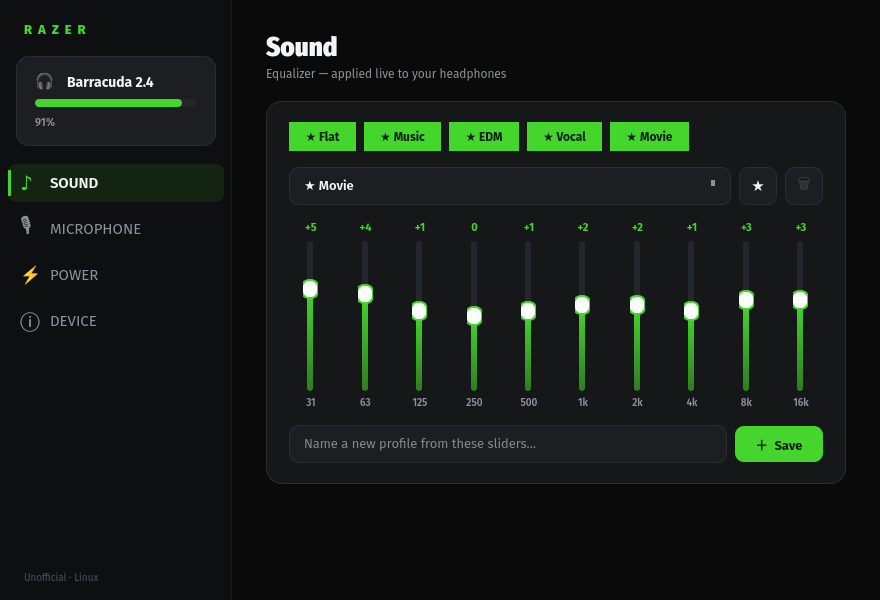

# Razer Barracuda 2.4 on Linux

Reverse-engineering notes, tools, and an OpenRazer integration for the **Razer
Barracuda 2.4** wireless headset (`1532:053C`) on Linux.

This documents the headset's two control paths (the 2.4 GHz USB dongle and
Bluetooth), the full HID/BLE command protocol, the built-in equalizer command,
and exactly what is and isn't reachable over each path — learned by capturing
both the USB dongle traffic and the Razer mobile app's Bluetooth traffic.

> Full technical write-up: [`FINDINGS.txt`](FINDINGS.txt)



*Standalone PyQt6 control panel (Synapse-style): live 10-band headphone + mic EQ,
profiles/favourites, sidetone, power, and device status — all native on Linux.*

## TL;DR — what works where

| Feature | 2.4 GHz dongle (USB) | Bluetooth (GATT) |
|---|---|---|
| Audio playback | ✅ (USB audio class) | ✅ |
| Device recognition (OpenRazer/Polychromatic) | ✅ | — |
| Connection-state read (`param 0x20`) | ✅ | ✅ |
| **Battery %** (`param 0x21`) | ✅ (after RF refresh) | ✅ |
| **Charging** (`param 0x2a`) | ✅ (after RF refresh) | ✅ |
| **Sidetone** (`0x98/0x99`) | ✅ real command | ✅ |
| **Power-saving** (`0xac`) | ✅ real command | ✅ |
| **Equalizer** / THX / Mic-NC | ❌ PC-side DSP (not a device command) | EQ ✅ via BLE |
| Mic mute / volume | system mixer (USB audio) | — |

**Battery/charging read over the 2.4 dongle — no Bluetooth needed.** Send the
RF-refresh frame (`01 80 07 50 41 0e 08 02 e1 01`, class `0x0e` / param `0xe1`)
to make the dongle pull a fresh value from the headset, then `GET 0x21` / `0x2a`.

**Sidetone and power-saving are real over-dongle commands** — verified by
driving Synapse and watching the bus: enabling sidetone sends `SET 0x98=1` +
`SET 0x99=<level>`, the power-saving slider sends `SET 0xac=<minutes>`. EQ, THX
Spatial and Mic Noise Cancellation are **not** device commands at all — Synapse
applies them in the Windows audio pipeline (PC-side DSP), so over 2.4 there is
nothing to send; on Linux replicate them with EasyEffects. See
[`FINDINGS_synapse_ui_capture.md`](FINDINGS_synapse_ui_capture.md).

## The protocol (short version)

Both paths share the same command shape: `<param> 00 01 <value>`.

- **2.4 dongle (HID, 64-byte reports, report id `0x01`):**
  `01 80 <len> 50 41 08 <txid> <subcmd> <param> [data]`
  — `50 41` = "PA", `subcmd` `0x03`=GET / `0x04`=SET. Telemetry comes back as
  `50 49` ("PI") reports: `param@13`, `value@16`.
- **Bluetooth (BLE/ATT):** ATT Write to handle `0x0014`, value
  `<param> 00 01 <value>`.

### Equalizer command (`param 0x93`)
The headset has a **built-in hardware EQ**. The mobile app selects a preset by
writing `93 00 01 <preset>`:

| Preset | value |
|---|---|
| Default | `0x00` |
| Game | `0x01` |
| Movie | `0x03` |
| Music | `0x02` |
| Custom | `0xff` |

## Tools (`tools/`)

| File | What |
|---|---|
| `razer_barracuda_gui.py` | PyQt6 control panel (connection, sidetone, power-saving, EQ presets, software-EQ launch) |
| `razer_barracuda.py` | CLI (`battery` / `status` / `sidetone` / `power-saving`) over the 2.4 dongle |
| `barracuda_record.py` | Full HID recorder: param sweep + passive event capture |
| `btsnoop_decode.py` | Minimal `btsnoop_hci.log` decoder for Bluetooth captures |
| `razer-barracuda-eq.json` | EasyEffects 10-band preset (PC-side software EQ) |
| `99-razer-barracuda.rules` | udev rule (OpenRazer group + non-root hidraw access) |
| `barracuda-control`, `razer-barracuda.desktop` | launcher + app-menu entry |

> The GUI's write controls (sidetone/power-saving/EQ) only take effect over
> **Bluetooth**, so on a PC with no Bluetooth adapter they are inert. They're
> kept ready for a BLE backend (see below).

### udev (non-root access)
```sh
sudo cp tools/99-razer-barracuda.rules /etc/udev/rules.d/
sudo udevadm control --reload-rules
# replug the dongle
```

## Audio control on Linux (PipeWire) — `pipewire/`, `wireplumber/`

The device's EQ/THX/mic-NC aren't dongle commands (they're PC-side DSP), so on
Linux they're **rebuilt natively in the audio graph** — no Bluetooth, no Windows,
no extra app. All live and reboot-persistent. Full diagnosis in
[`FINDINGS.txt` §11](FINDINGS.txt) and [`pipewire/README.md`](pipewire/README.md).

| Capability | How |
|---|---|
| **10-band headphone EQ** | PipeWire `filter-chain` sink (`barracuda_eq`), gains driven live from the GUI via `pw-cli`, 12 tuned profiles + favourites + custom save |
| **10-band microphone EQ** | virtual source *"Barracuda Mic (clean)"* = fixed 75 Hz high-pass + `mic0..mic9`, same GUI band-sliders, 8 voice presets |
| **Sidetone** | `module-loopback` mic→sink (software mic monitoring) |
| **Low latency** | PipeWire quantum 512 (~10 ms) vs the default ~42 ms — `98-low-latency.conf` |
| **Mic anti-clip** | ALSA capture-gain headroom (the "brr"/distortion was ADC clipping, not buffering) |
| **Anti-crackle / anti-dropout** | never-suspend the nodes, lock the rate to 48 kHz, output-only buffer cushion (`wireplumber/51-barracuda-mic.conf`) |

These were the hard part — see the engineering notes below for *why* each one is
what it is (it's a single-rate, half-duplex, **USB 1.1** wireless device, and that
constraint explains every symptom).

## OpenRazer / Polychromatic integration (`openrazer/`)

Patches that add the Barracuda to OpenRazer so it appears as a recognized
headset (name, serial, firmware) in OpenRazer and Polychromatic. It does **not**
add controls — the device has no RGB, and battery isn't reachable over the
dongle, so there's nothing OpenRazer can expose to control. See
[`openrazer/README.md`](openrazer/README.md).

## Getting full control (battery + EQ + sidetone)

These live on **Bluetooth**. With a Bluetooth adapter on the PC, a BLE client
(BlueZ / `bleak`) can connect to the headset's GATT and write/read handle
`0x0014` exactly like the phone app — giving EQ (`0x93`), sidetone (`0x98/0x99`),
power-saving (`0xac`), and live battery (`0x21`). A BLE backend for the included
GUI is the natural next step. (PRs welcome.)

## Capturing the Bluetooth protocol yourself

See [`FINDINGS.txt` §6](FINDINGS.txt) — enable Android "Bluetooth HCI snoop log",
pull it via `adb bugreport`, decode with `tools/btsnoop_decode.py`.

## ⚠️ Safety

Send **only** correctly-framed `50 41` ("PA") frames. A blind, unframed bare-
opcode sweep can hit an "enter bootloader" command — the dongle flips to PID
`0x5020` ("Macronix"), audio dies, and recovery needs a firmware re-flash via
Synapse on Windows. Details in `FINDINGS.txt` §8.

## How this was reverse-engineered (engineering notes)

No datasheet, no vendor docs, no Linux prior art that worked — the device was
black-boxed from both ends and rebuilt from observed behaviour.

**Method — capture, don't guess.** Every command in this repo was *observed on
the wire*, never brute-forced into the device:
- **USB side:** drove Razer Synapse on Windows and captured the dongle's HID
  traffic, then diffed captures across UI actions to isolate each command
  (sidetone toggle → `SET 0x98`, power-saving slider → `SET 0xac`, etc.).
- **Bluetooth side:** the EQ lives only on BLE, so captured the Razer *mobile*
  app instead — Android "Bluetooth HCI snoop log" → `adb bugreport` → wrote a
  `btsnoop_hci.log` decoder (`tools/btsnoop_decode.py`) → found the EQ write to
  GATT handle `0x0014`.
- **Validation:** a read-only `GET 0x00..0xff` param sweep mapped the dongle's
  168 responding params (`FINDINGS_dongle_param_map.md`) to separate real
  controls from constants.

**War stories (the parts that teach you something):**
- **Bricked it, recovered it.** An early *unframed* opcode sweep hit an
  undocumented "enter bootloader" command — the dongle flipped PID `053C→5020`,
  manufacturer string changed to "Macronix", audio died. Recovered by
  re-flashing firmware via Synapse, then root-caused the framing bug (a
  double-prepended report-id byte shifted writes into bare-opcode space) and
  added a hard safety rule: **only ever send verified `50 41`-framed frames.**
- **"Battery doesn't work" was wrong.** The dongle *does* answer `GET 0x21`, but
  only after an RF-refresh frame (`class 0x0e / param 0xe1`) pokes it to pull a
  fresh value over 2.4 GHz — found by noticing Synapse sends that frame before
  *every* battery poll.
- **Three different "bad audio" bugs that looked like one.** Systematic
  bisection (prove the capture path clean with `pw-top ERR=0` *before* blaming
  it) separated: latency = oversized buffer; mic "brr" = ADC **clipping** (gain,
  not buffering); ~1 s dropouts = **2.4 GHz packet loss** surfacing as a kernel
  `cannot get freq at ep` clock fault — three causes, three fixes, documented in
  `FINDINGS.txt` §11.
- **Knowing when to stop.** Forcing `api.alsa.period-size` on a USB 1.1 device
  *garbled* the audio — recorded the dead end so the next person doesn't repeat
  it. The root insight tying it all together: it's a single-rate (48 kHz),
  half-duplex, **USB 1.1** wireless device, and that one constraint predicts
  every symptom.

**What's in here as a result:** a clean-room HID/BLE protocol spec, a userspace
hidraw CLI + a Synapse-style PyQt6 GUI, native PipeWire audio (headphone + mic
EQ, sidetone, latency/crackle/dropout tuning), an OpenRazer device patch, and a
full findings document — built iteratively against a live device with empirical
A/B testing at every step.

## License

MIT for the original tools and documentation (see `LICENSE`). The files under
`openrazer/` are patches against [OpenRazer](https://github.com/openrazer/openrazer)
and are derivative works licensed **GPL-2.0-or-later**, matching OpenRazer.

## Disclaimer

Unofficial, not affiliated with or endorsed by Razer. Reverse-engineered for
interoperability on Linux. Use at your own risk.
